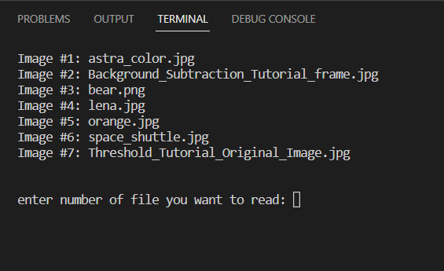

# OpenCV Histogram Equalization

Histogram equalization is a basic image processing technique that adjusts the global contrast of an image by updating the image histogram’s pixel intensity distribution. Doing so enables areas of low contrast to obtain higher contrast in the output image.

Essentially, histogram equalization works by:
- Computing a histogram of image pixel intensities
- Evenly spreading out and distributing the most frequent pixel values (i.e., the ones with the largest counts in the histogram)
- Giving a linear trend to the cumulative distribution function (CDF)

The result of applying histogram equalization is an image with higher global contrast.

For more detail, Please read [Report](Report/main.pdf).

## How work?
All of data is available in <code>Images</code> folder. After you run the code, all the images in the <code>Images</code> folder will be shown to you and you can select one of
them. like below:

